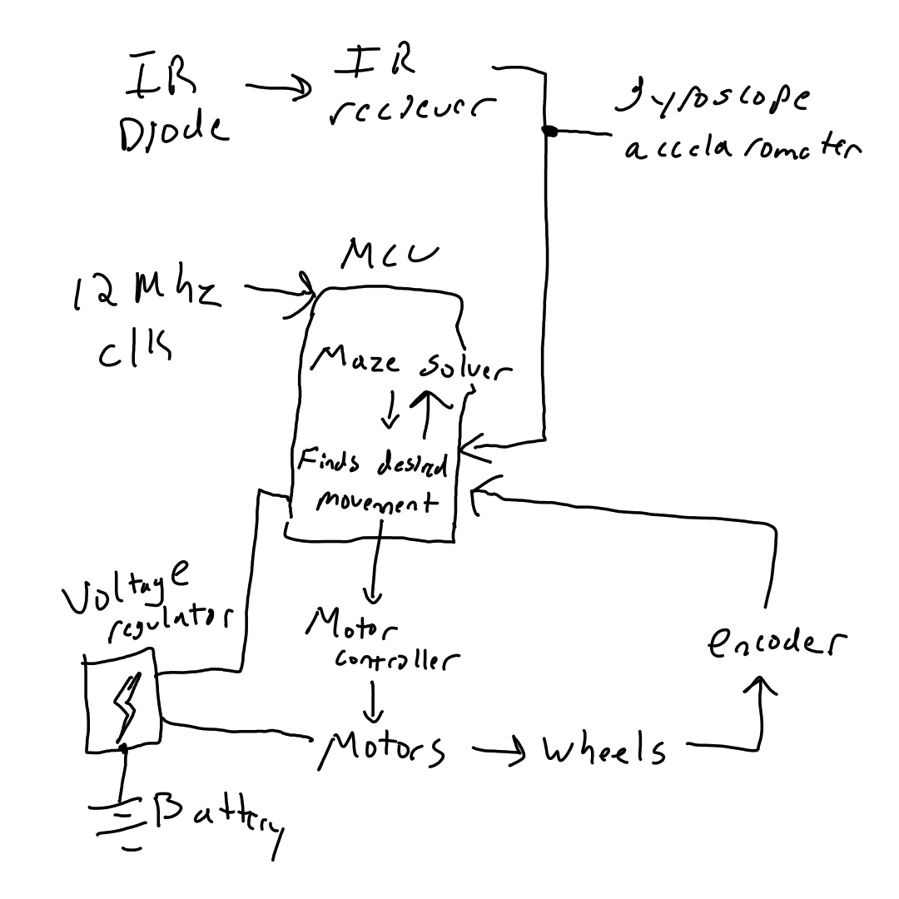
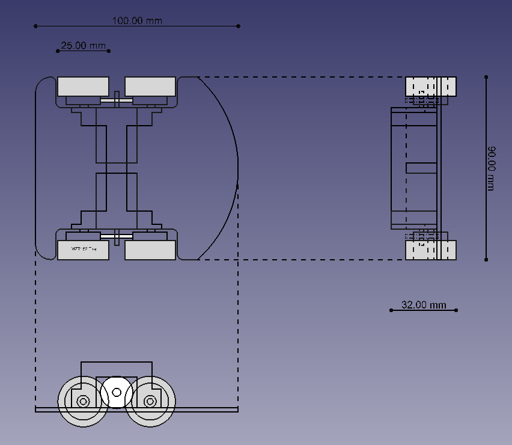
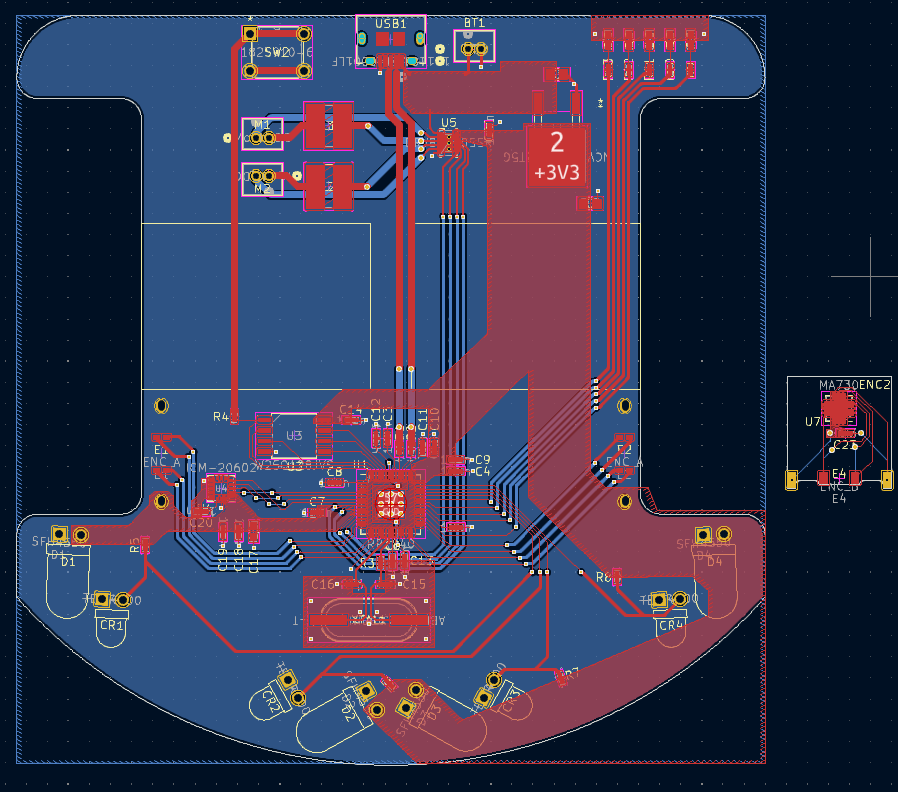

# PCB mouse proposal
(still thinking of a name)

## Overview

The body of the mouse will consist of the PCB that contains the electrical circuit and 3D printed motor housing and driver components. The microcontroller board that is used will be a RP2040 that uses an external 12MHz clock. Current difficulties include dimension specifications as some housing components are close to colliding with circuit components. This leaves us with some tight tolerances at times and the reccommended course of action is to respecify some dimensions. Currently the mouse is 10cm X 9cm X 3.2cm which is well under the size requirement but needs to be kept small as our team wishes to give our mouse the ability to create diagonals

### Software Plan
The search algorithm will be made in Java. Once this search algorithm has been finalized, it will be translated to C for the robot. The robot itself will also be coded in C for the sake of memory and speed efficiency. The search algorithm will be tested in the simulation as well as in real life with the robot. VS Code will likely be the main IDE used. We will use different hardware inputs such as infared sensors, gyro, and encoders to deteremine location, distance, acceleration, and speed. 

### Hardware Plan
The main chassis of our mouse will consist of a custom PCB that we design. Most of our electrical components are surface-mount, although a few are through-hole. Once the design gets finalized in CAD, we will order the PCB and a solder stencil to be manufactured. The stencil will help apply solder paste to connection points on the board for attaching the SMT components. The remaining through-hole components will be hand-soldered to the PCB.

The RP2040 microcontroller will control our mouse. The RP2040 requires several decoupling capacitors, a flash memory chip, and a 12 MHz clock. The mouse will include a USB port for programming the RP2040. Before it can be programmed, the RP2040 must enter BOOTSEL mode, which we will achieve with an SPST button.

The mouse will get power from either the battery or the USB port. Motors will get powered directly from the battery or USB. The remaining components all operate at 3.3V, so we will include a 3.3V buck converter to provide a consistent voltage to them.

The mouse will include several sensors to detect its surroundings. First, four pairs of IR Emitters and PhotoTransistors are mounted on the front. These sensors detect the distance to surrounding walls. The PhotoTransistors will get wired to the RP2040's ADC pins. The mouse will also include an IMU to sense the angle and acceleration. The IMU is controlled over SPI. Next, the mouse will have an encoder on each side to detect the mouse's speed and distance traveled. The encoders are also controlled over SPI. These sensors will produce reliable data to help the mouse understand its surroundings and traverse the maze confidently.

The drivetrain on each side will consist of a DC motor geared to drive two wheels. A 3D printed mount for the Motor and two shafts will be designed and printed, then attached to the PCB. We will use a Dual H-Bridge motor driver controlled over PWM to operate the Motors. The specific chip we plan to use has separate motor and logic supply pins, meaning that battery voltage can directly control the Motors, and the regulated 3.3V will power the chip itself. Each Motor will be wired to an inductor to handle noise and protect against back EMF.
Finally, we will include 5 LEDs on the mouse to feedback state/error information. Each LED will be a different color for easier pattern recognition. We will also have two buttons to command the mouse (specific purposes TBD).

A battery voltage has not yet been determined, although anywhere in the 5-9V range is reasonable.

## Flowchart of System Design

Needs to be made better but the simple version is the microcontroler recieves input data from its sensors (IMU, and infared) as well from the encoder. It processes this data and sends pulses to the motor controller which in turn sends a voltage to the motors.

## Parts and Costs

### Purchases

| Item | Cost | Quantity | Total Cost |
| ---- | ---- | -------- | ---------- |
| [RP2040](https://www.digikey.com/short/0jwn1013) | $0.70 | 1 | $0.70 |
| [W25Q128JVS](https://www.digikey.com/short/3fp8wpq2) | $1.68 | 1 | $1.68 |
| [ICM-20602](https://www.digikey.com/short/52qpf591) | $6.97 | 1 | $6.97 |
| [DRV8835DSSR](https://www.digikey.com/short/j48rzmbm) | $1.64 | 1 | $1.64 |
| [NCV1117DT33T5G](https://www.digikey.com/short/vj5t48t1) | $0.71 | 1 | $0.71 |
| [SFH4550](https://www.digikey.com/short/m75cbb83) | $0.94 | 4 | $3.76 |
| [TEFT4300](https://www.digikey.com/short/dwpnzbrt) | $0.70 | 4 | $2.80 |
| [Adafuit 711](https://www.digikey.com/short/83vh2rn4) | $1.95 | 2 | $3.90 |
| [MA730](https://www.digikey.com/short/nfrnpqvd) | $5.74 | 2 | $11.48 |
| [10118194-0001LF](https://www.digikey.com/short/rbvwhhqv) | $0.46 | 3 | $1.38 |
| [B2B-ZR](https://www.digikey.com/short/f20jrn09) | $0.18 | 3 | $0.54 |
| [B3B-ZR](https://www.digikey.com/short/3zbfc14p) | $0.19 | 1 | $0.19 |
| [1825910-6](https://www.digikey.com/short/bp9bvt07) | $0.13 | 3 | $0.39 |
| [ABLS-12.000MHZ-B4-T](https://www.digikey.com/short/v78cbqb3) | $0.21 | 1 | $0.21 |
| [LTST-C191KRKT](https://www.digikey.com/short/548nfp5z) | $0.25 | 1 | $0.25 |
| [LTST-C191KFKT](https://www.digikey.com/short/wfp3fmj7) | $0.23 | 1 | $0.23 |
| [LTST-C191KSKT](https://www.digikey.com/short/05pwc438) | $0.27 | 1 | $0.27 |
| [LTST-C191KGKT](https://www.digikey.com/short/8h9v1f0d) | $0.25 | 1 | $0.25 |
| [LTST-C191TBKT](https://www.digikey.com/short/h3ct438r) | $0.34 | 1 | $0.34 |
| [GCM1555C1H270FA16J](https://www.digikey.com/short/nj98pqqp) | $0.10 | 2 | $0.20 |
| [GRM155R70J105KA12J](https://www.digikey.com/short/mmntvwvj) | $0.10 | 4 | $0.40 |
| [GRM21BR61C106KE15K](https://www.digikey.com/short/5z3wprjp) | $0.10 | 2 | $0.20 |
| [GRM1885C1H103JA01D](https://www.digikey.com/short/p47ztb7h) | $0.17 | 1 | $0.17 |
| [GRM155R71C104JA88D](https://www.digikey.com/short/tz035mwv) | $0.10 | 13 | $0.48 |
| [GRM155C80J225KE95D](https://www.digikey.com/short/fz4wmv8d) | $0.10 | 1 | $0.10 |
| [SRR4028-470Y](https://www.digikey.com/short/tqb9hv9z) | $0.79 | 2 | $1.58 |
| [RC0402FR-0727RL](https://www.digikey.com/short/mfw0rdhn) | $0.10 | 2 | $0.20 |
| [RC0402FR-071KL](https://www.digikey.com/short/9t5dh3zh) | $0.10 | 3 | $0.30 |
| [RC0402FR-0710KL](https://www.digikey.com/short/2hhhvjfv) | $0.10 | 4 | $0.40 |
| 5 PCBs | $19.00 | 1 | $19.00 |
| Stencil | $24.00 | 1 | $24.00 |
| Battery | | 2-4 | |
| Tire | | 4 | |
| Shaft | | 4 | |
| Shaft Clamp | | 4-6 | |
| Solder Paste? | | 1 | |
| | | **Total** | ~$84.72 |

> ^ Every component above is from an approved vendor except our custom PCB and solder stencil. These are from JLCPCB. We've written up a vendor proposal for JLCPCB for the SA to look at.

### Custom Creation

1. Wheels - 3D printed. 
2. Gears - 3D printed.
3. Motor/Shaft mount - 3D printed.
4. PCB & Solder Stencil - Manufactured by vendor.

### Parts on Hand

1. Motor Wires?
2. Solder Paste?

## 3D Model

## Teammates and Responsibilities

### Samuel (Software Engineer)
Sam will work on the algorithm, most likely flood fill. He will write it in Java and will translate it in the future into C. He will also work on programming the robot as well as possibly doing things such as speed tuning with algorithms including PID and feed-forward algorithms. 

### Dylan (Electrical/Mechanical Engineer)
Dylan will work on designing the PCB and Hardware that interacts with mechanical components such as the encoders, motor and wheel mount assemblies. He will also assist with converting algorithms designed in java to C. And the control system involved in processing feedback from the motor and IR sensors as well as processing signals from the other onboard sensing devices and sending the motors commands. 

### Peter (Electrical/Mechanical Engineer)
Peter will work on creating the pcb

## Milestones

### Milestone Set 1: 11/07/23
* Design of PCB and encoders finalized
* understand all the code in the simulation repository
* research and start to implement the flood fill algorithm

### Milestone Set 2: 11/14/23
* Motor/wheel mount sub-assembly design finalized

### Milestone Set 3: 12/11/23
* Mouse fully assembled and One maze solving algo complete

### Milestone Set 4: 12/31/23
* Mouse can finish maze with static turning and movement
* Controls systems implemented

### Milestone Set 5: 1/24/24
* mouse can finish maze with continuous movement

### Milestone Set 6: 2/12/24
* Mouse can complete maze using diagonals
* Mouse is ready to compete for E-week
* Introduce speed tuning such as PID 

### Milestone Set 7: 3/1/24
* Mouse is competition ready

